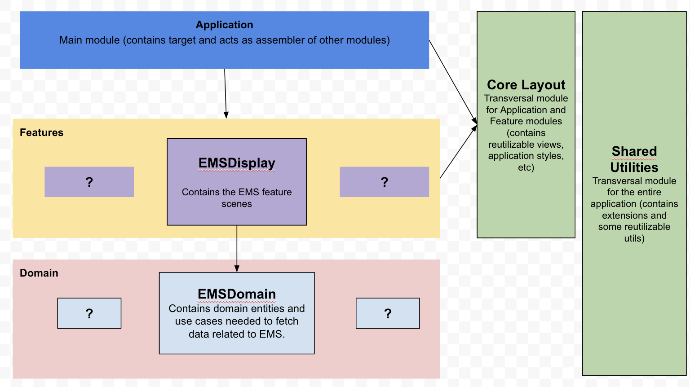
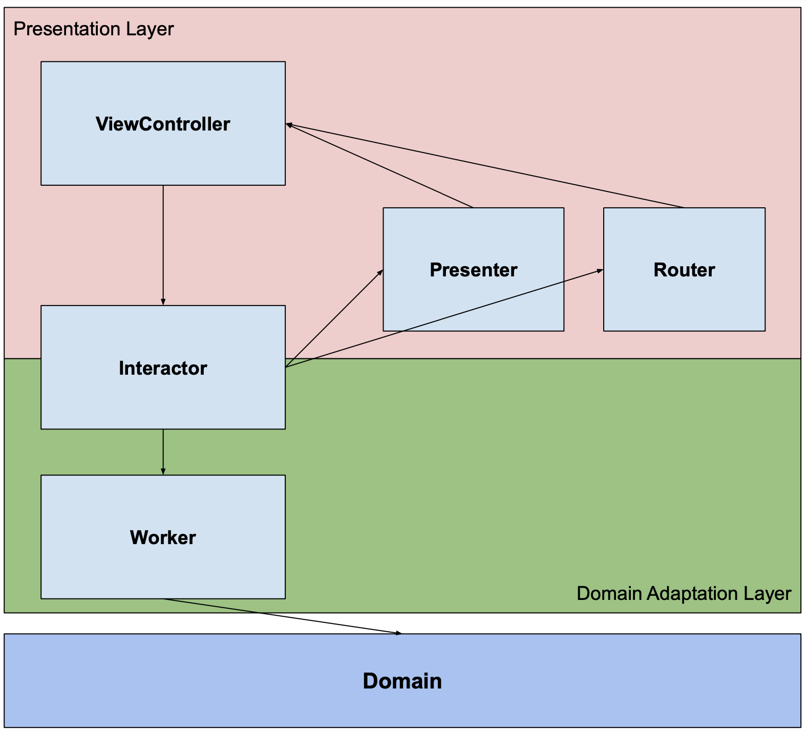

# Wallbox-CodeChallenge

This project is an iOS app as code challenge for Wallbox. The app will consume an stubbed API, with jsons. 

Requirements of the app: 

[see requirements](https://gitlab.com/carandahe/ems-demo-project)

## Installation
1. Clone the repository and navigate to the directory of project using the terminal.
2. Install dependencies with Cocoapods using `pod install`.
3. Open the workspace.
4. Play! build&run the application.

## Modularization

### Modules Overview

The app is composed by the following modules:

  

### Presentation pattern

The scenes inside the Features layer are built with a modified VIP (Clean Swift) architectural pattern:

  

### Tests
- The two scenes of EMSDisplay are tested with snapshots and unit tests
- EMSDomain fully tested.

## Tech  tools
### Development tools
- Language: Swift 5
- IDE: Xcode 13.2
- Dependency manager: Cocoapods
- Version control: Git

### Third party libraries

- [Charts](https://github.com/danielgindi/Charts): User for plotting data. 
- [GaugeKit](https://github.com/skywinder/GaugeKit): Used for displaying beautiful ui gauge elements 
- [SnapKit](https://github.com/SnapKit/SnapKit): To use autolayout programmatically.
- [SwiftMessages](https://github.com/SwiftKickMobile/SwiftMessages): To present custom messages.
- [NVActivityIndicatorView](https://github.com/ninjaprox/NVActivityIndicatorView): Used for displaying an alternative activity indicator.
- [SwiftyMocky](https://github.com/MakeAWishFoundation/SwiftyMocky): Used for creating mocks, stub returned values and invoke verifications.
- [SnapshotTesting](https://github.com/pointfreeco/swift-snapshot-testing): Used for Snapshot testing.
